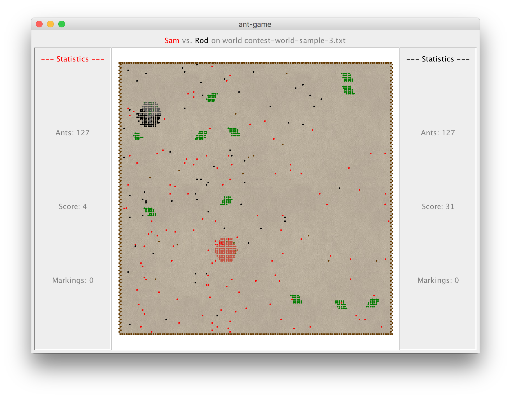

# ant-game  

A competitive strategy game between two or more players.

Each of the players design an *ant brain*, which is a file containing instructions for ants to carry out in a simulated ant world. The ant brains will contain instructions on how the ants will react based on their current state and the local environment. Once loaded into the program, two colonies of ants compete in a simulated ant-world to bring as much food as possible back to their anthill. The ant world contains obstacles, food, and the two opposing anthills. Ants are able to leave markers for other ants to sense, and can also kill opponent ants by surrounding them. The game is won by the ant colony which obtains the most food.

