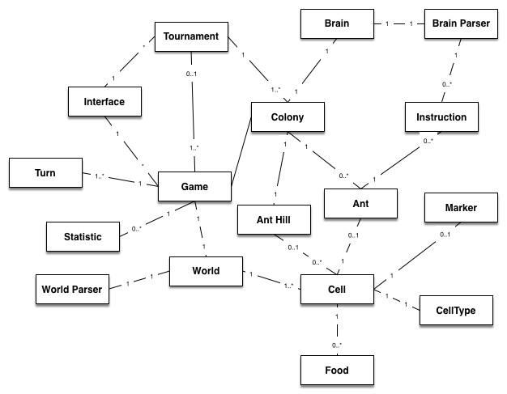
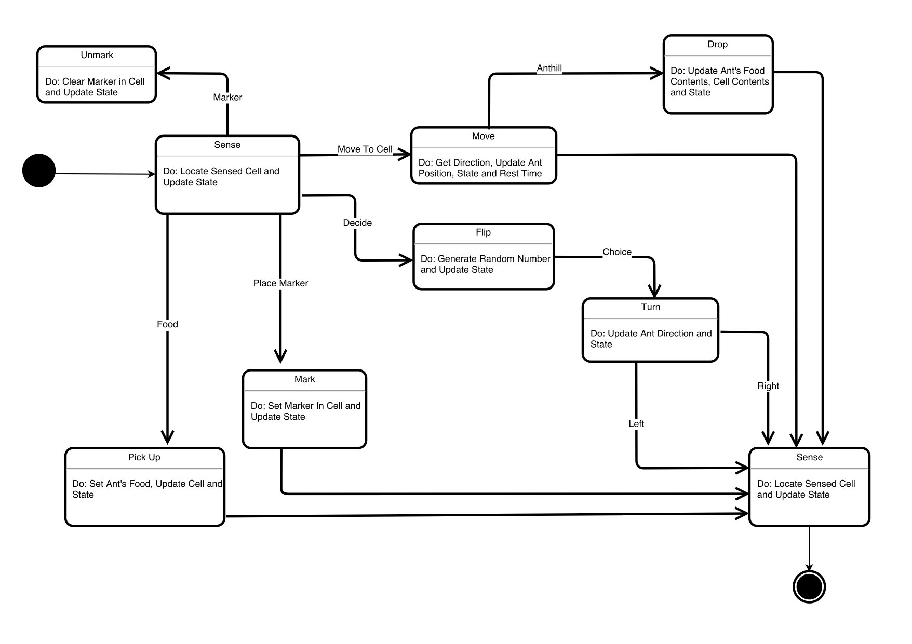
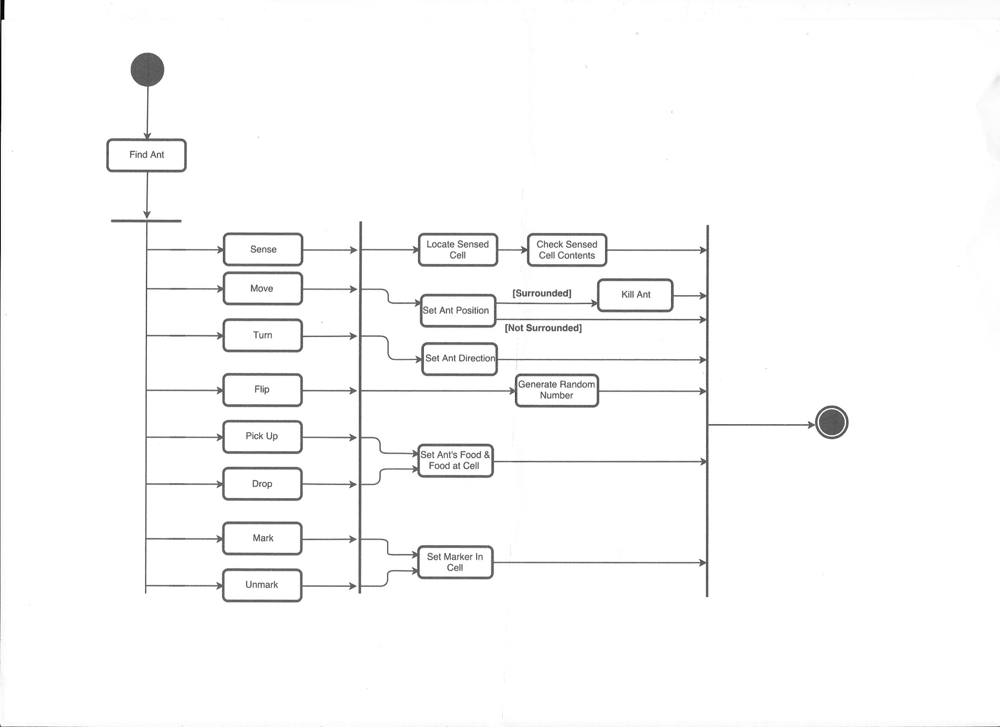
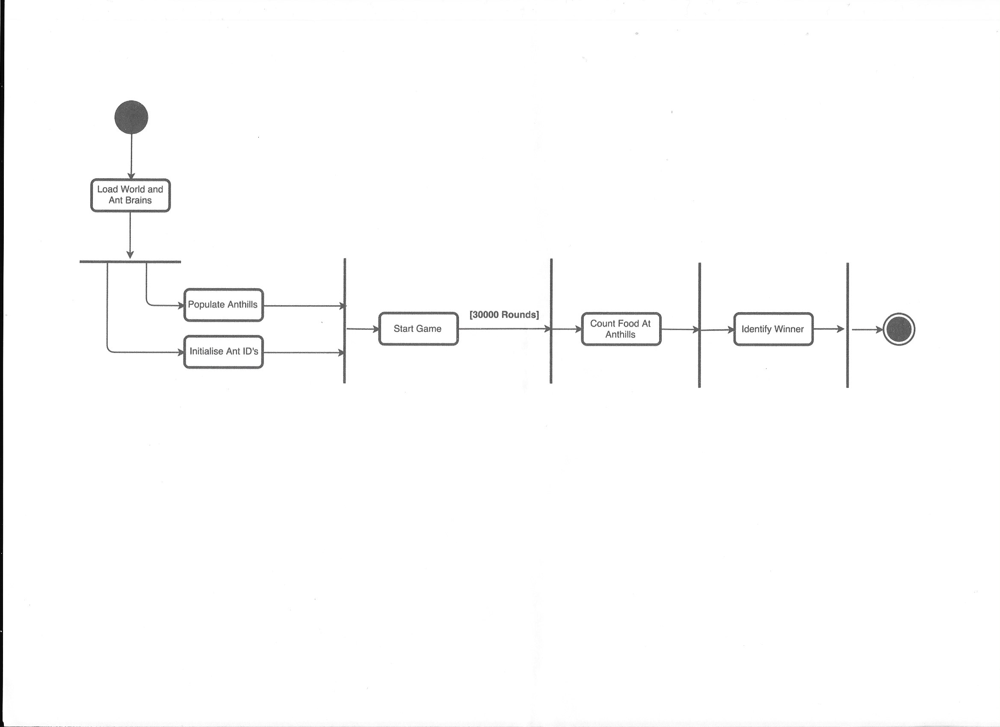
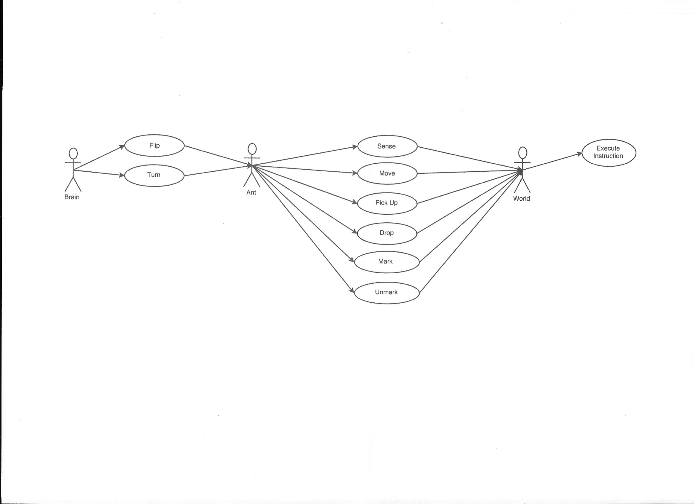

# Design

## High-Level

The high-level design serves as a transition between the requirements and the full low-level design. Below are designs used to identify key components of the system and how they shall interact, both with each other and with the user.

##### Identification of possible future classes and their associations
 

 
##### Ant - state diagram

###### State

- Sense: The ant locates a cell either in front (`Ahead`), to its left (`LeftAhead`) or its right (`RightAhead`) and updates its state.
- Move: The current direction of the ant is obtained and its position is updated to the sensed cell along with its state.
- Drop: The ant's food content is put into the cell and its current food and state are updated along with the cell's contents.
- Flip: The ant makes a decision to turn left or right by generating a random number and its state is updated.
- Turn: The ant's current direction is updated to left or right and its state is updated.
- Mark: The ant sets a marker of its own colour in the sensed cell and it's state is updated.
- Unmark: An ant's marker is cleared in the sensed cell and its state is updated.
- Pick Up - The ant collects the amount of food in the sensed cell, its food contents, the cells contents and its state is updated.

###### Stimulus

- Move To Cell: The ant has chosen to move to the sensed cell.
- Decide: The ant has chosen to decide whether to turn left or right.
- Choice: The ant has made its choice and now turns either left or right.
- Left: The ant turns left.
- Right: The ant turns right.
- Place Marker: The ant has chosen to place a marker in the sensed cell.
- Food: The ant has located some food in the sensed cell.
- Marker: The ant has located a marker in the sensed cell.
- Anthill: The ant has located a cell which is part of its anthill after moving.

##### Ant Functionality - state diagram

###### Functions

- Sense: This function takes a cell as an input, it must find this cell, and then checnk its contents, for objects such as food or another ant. 
- Move: This function sets the new position (in a cell) of the ant. If it is surrounded by other ants, it must be killed, if not, nothing happens. 
- Turn: The ant's current direction is updated to the new inputted direction. 
- Flip: A random number is generated.
- Pick Up - The ant collects food in the cell, the food contents of itself and the cell are updated. 
- Drop: The ant drops food in the cell, the food contents of itself and the cell are updated. 
- Mark: The cell has a new marker set. 
- Unmark: An ant's marker is cleared in the sensed cell.

##### Game Activity Diagram

This diagram shows how the game operates in a high-level view. Ant brains and a single world are loaded by an actor. This then initialises different anthills for each different ant-brain. Each ants IDs are also initialised. The game is then started, lasting for 3000 rounds. Once the round counter is at its maximum, the food at each anthill is counted; the team with the most food at their brains anthill is declared the winner. 

##### Use Case Diagram

The brain has a choice of either flipping (choosing a random number, going to one of two states depending on identity of this number) or turning the current ant. This ant has a choice of actions it can undertake. Once a function is chosen, the world is notified, and it executes the instruction in the game, by interacting with the other components. 

