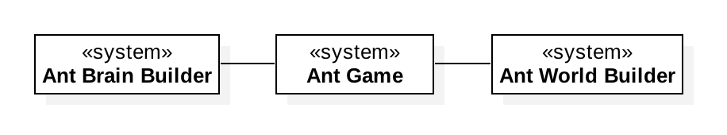
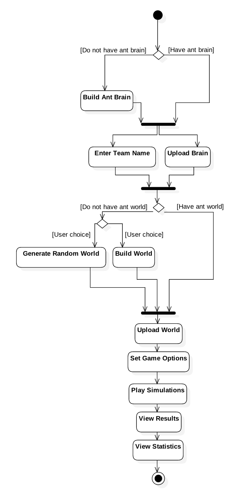
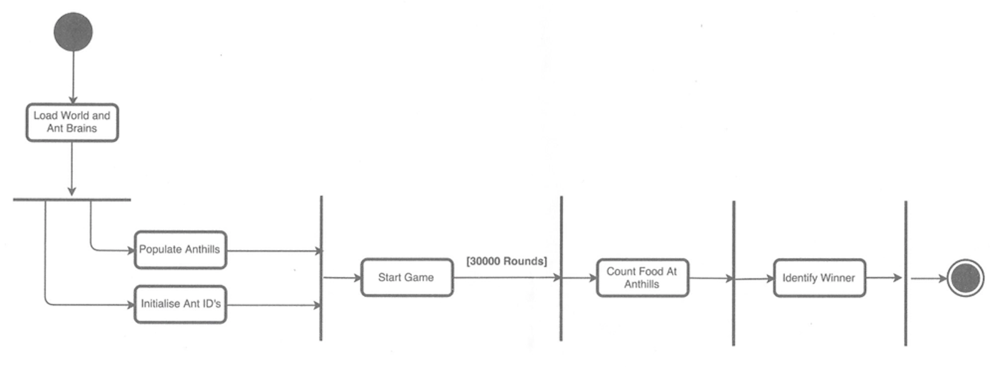
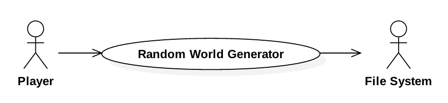
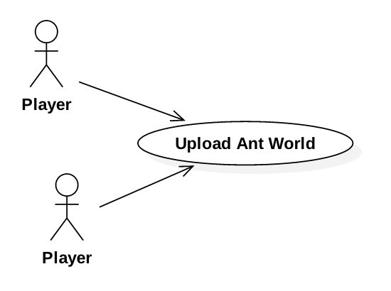
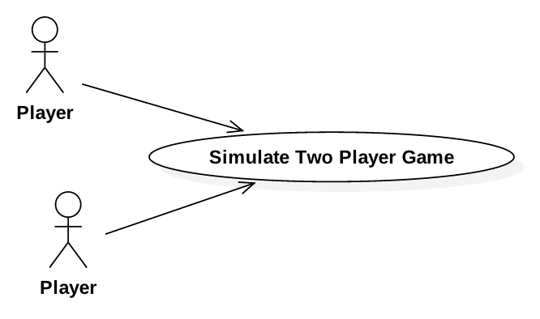
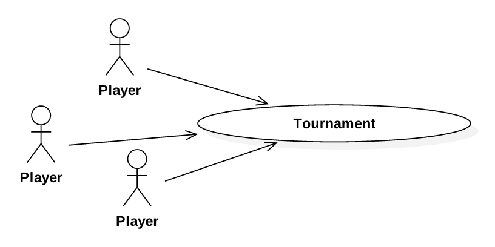

# Design

## High-Level

The high-level design serves as a transition between the requirements and the full low-level design. Below are designs used to identify key components of the system and how they shall interact, both with each other and with the user.

### Context Model

As with many computer games, this system is mostly 'self-enclosed' - that is, it does not require a large amount of interaction with separately-developed external systems. Thus, the context of the Ant Game system is minimal. However, unlike many other computer games, the style of the game can require the user to provide some external 'data' before playing (an ant brain, and sometimes an ant-world). This means that there is a possibility for external programs to be developed to aid the user in writing a custom ant brain/world. This would mean that there would be an interaction between the Ant Game program and two other systems, as below:

However, as per the functional requirements document (`Game/4` and `World/1`) the program shall parse ant brains and worlds from a *file* (i.e. only indirectly received from outside software), so this interaction with external programs does not need to be accounted for in development.

### Process Model

#### User Process

The process model below describes a player interacting with the ant game system. Note that the only two actions where the user is not directly interacting with the program is the `Build Ant Brain` action and `Build World` action - both of these actions are done independently of this system by the user (in a text editor or otherwise). This process model is abstract enough that it applies to both the two-player game and the tournament. It is assumed that at least two users are following this process model at the same time, and interacting with the same instance of the program. 

#### Game Process

The following diagram gives a high-level view of the flow of the system when simulating a game between two ant colonies on a particular world. Ant brains and a single world are loaded by two actors (the players). The system then initialises ants on the two anthills for each colony. Each ants identifiers are also initialised, as per the order in the functional requirements. The game is then started, lasting for 300,000 rounds. Once the round counter is at its maximum, the food at each anthill is counted; the team with the most food at their brains anthill is declared the winner. 

### Use Cases

The process model makes it clearer as to how the user will interact with the system. From the process model and the requirements, the primary use cases of the system have been extracted, as below. The only (human) actors in the following use cases are the players of the game.

#### Upload Ant Brain

| | Ant Game: Upload Ant Brain |
| --- | --- |
| Actors | Each player in a two-player game or a tournament. That is, although not interacting with each user simultaneously, the system will be interacting with multiple users in turn. |
| Description | In order to simulate a game, the players must upload their custom ant brains. These must be parsed from file into memory. |
| Data | The location of a file on disk. |
| Stimulus | Triggered by user clicking on a file-chooser button, navigating to the path of the file, and clicking 'Parse' (on the game setup screen of the system's interface). |
| Response | Whether the file represented a valid ant brain as per the functional requirements for parsing given in `Parsing Specifications/Brain`. If invalid, the system should inform the user of what went wrong and on which line (if relevant). |

#### Generate Random World

| | Ant Game: Generate Random World |
| --- | --- |
| Actors | A player, before a game or tournament. Filesystem. |
| Description | A tournament requires a world that conforms to the specifications laid out in the functional requirements (see requirement `World/2`). This component of the system can be interacted with by the user to write a random world to file which conforms to these specifications. |
| Data | - |
| Stimulus | Triggered by the user by interacting with the GUI, selecting the option to generate a random ant world. |
| Response | Generates a random ant world. Converts the ant world to a textual description, as per functional requirement `Parsing Specifications/World`. Asks the user where to save to on disk, and then writes to a text file at that location. |

#### Upload Ant World

| | Ant Game: Upload Ant World |
| --- | --- |
| Actors | Two or more players who agree to upload a particular ant world to compete on. |
| Description | In order to simulate a game or tournament, there must be at least one ant world for the ants to compete on. These must be parsed from file into memory. |
| Data | The location of a file on disk. |
| Stimulus | On the game and tournament setup screens, there will be a button to upload an ant world. Once the user clicks on this, chooses a file to parse, and clicks 'Parse', this use case will be invoked. |
| Response | Whether the file represented a valid ant world as per the functional requirements for parsing given in `Parsing Specifications/World`. In addition, if this use case is invoked in the context of a tournament setup, the additional criteria for a contest world shall be checked (see requirement `World/2`). |

#### Simulate Two Player Game

| | Ant Game: Simulate Two Player Game |
| --- | --- |
| Actors | Two players. |
| Description | Once the game setup is complete (with players setting the ant brains and ant world) this use case comes next, with a competition between the ants on the world being simulated. |
| Data | The contextual data from other use cases will be in memory - the world and brains. Some other relevant data shall be provided by the user, such as the team names and options for game viewing (detailed in the interface design section). |
| Stimulus | The 'Play' button on the game setup screen. |
| Response | The system will simulate a game between the two ant colonies as described in the functional requirements (`Game/1`). It will present a simulation of the world as the ants carry out their actions. At the end of the simulation, it will display the winner of the game to the players, as well as relevant game statistics. |

#### Tournament

| | Ant Game: Tournament |
| --- | --- |
| Actors | Two or more players. |
| Description | This use case can be considered a 'superset' of the use Two Player Game use case. Once each of the players have uploaded the ant brains and ant worlds, they can start a tournament to compete amongst multiple ant brains on multiple ant worlds, to see which player is the overall winner. |
| Data | The contextual data from other use cases will be in memory - the worlds (at least one, possibly several) and brains. As above, some other relevant data shall be provided by the user, such as the team names and options for game viewing. |
| Stimulus | The 'Play' button on the tournament setup screen. |
| Response | The system simulates an ant game between every possible combination of teams, worlds, and colours (red or black). Then it returns the final results of the tournament to the user (as per the functional requirement `Game/3`) as well as statistics on the game. |

### System Components

From the functional requirements, the process model and use cases, the main system components and their interactions have been modelled below.

The system components diagram is extremely useful in terms of developing a full design, and is the fundamental building block of the low-level design section.