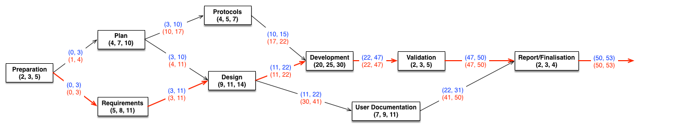

# Project Plan

## Introduction

### Project Outline

The primary aim for this software project is to develop a competitive strategy game to between two or more players.
Each of the players design an *ant brain*, which is a file containing instructions for ants to carry out in a simulated ant world. The ant brains will contain instructions on how the ants will react based on their current state and the local environment. Once loaded into
the program, two colonies of ants compete in a simulated ant-world to bring as much food as possible back to their anthill. The ant world contains obstacles, food, and the two opposing anthills. Ants are able to leave markers for other ants to sense, and can also kill opponent ants by surrounding them. The game is won by the ant colony which obtains the most food.

As specified by the client, the produced software must have the ability to:
- check if an ant-brain supplied by a player is syntactically well-formed.
- check if a given description of an ant world is syntactically well-formed and meets the requirements for ant worlds used in tournaments.
- visualise a given ant world.
- generate random but well-formed ant worlds.
- simulate an ant-world: that is, enable two players to upload their ant-brains and choose an ant-world, and then run the game in the ant world, taking statistics and determining the winner of the game.
- play tournaments, where an arbitrary number of players can upload ant-brains, who are all paired up to play against each other.

In addition, a custom ant-brain should be designed.

## Phase Plan

### Phase Summary

The first week of the project shall involve preparation of organisational documents and team organisation. In addition, development environments and general project configuration shall be set up - this includes version control and communication channels. The preparation phase should be complete by 28/02/2016 at the latest.

In the next week, the project plan shall be developed by the team. The primary components of the project plan shall include a protocol for conflict resolution, a full and detailed phase plan (including PERT chart), and an assessment plan. Alongside the plan, he team shall work in parallel to identify the functional, non-functional and domain requirements. Where any domain requirements are discovered, they shall be filtered into functional/non-functional requirements after discussion with the group. This phase shall be completed by 07/03/2016 at the latest.

Once the requirements are complete, the design phase will begin. This is the longest (and most challenging) phase, and shall be split up amongst the team based on the categories of functional (and non-functional) requirements. The first stage of the design phase shall be to identify key components of the software and identify the associations between them, forming a high-level design. Next, a lower level design shall be developed through the use of class diagrams (UML) and sequence diagrams. The design should be complete by 29/03/2016.

Next is the development phase. Again, the team will split into groups to work in parallel - with some members mainly focused on development and others focused on writing tests. The development shall follow the design specification as closely as possible, and where any ambiguities arise both the requirements and design will be revised where necessary. The development should be complete by 23/04/2016.

After development is complete, there shall be a final validation and completion phase. This will involve performing checks on the software (unit testing, verification, validation, release testing). In addition, user documentation for the program will be finalised, a custom ant-brain shall be designed, and a team report shall be written. These final tasks must be completed before the project deadline, 05/05/2016.

### Task Allocation & Time Estimation 

This table gives an approximate optimistic-realistic-pessimistic estimation for the time spent on each task in the project. All times are given in days.

| Task                     | Optimistic | Realistic | Pessimistic | Allocated 
| ------------------------ | ---------- | --------- | ----------- | ---------
| __Preparation__          |            |           |             | 
| Team Organisation        | 1          | 2         | 3           | Sal
| Configuration Management | 2          | 3         | 5           | Sam
| __Plan__                 |            |           |             |
| Conflict Resolution      | 1          | 2         | 3           | Dan
| Phase Plan               | 4          | 7         | 10          | Jeremiah
| Organisation Plan        | 3          | 5         | 7           | Sal
| Peer Assessment Plan     | 1          | 2         | 3           | Dan
| __Protocols__            |            |           |             |
| Acceptance Criteria      | 2          | 3         | 4           | Dan
| Development Protocols    | 1          | 2         | 3           | Sam
| Test Specification       | 4          | 5         | 7           | Sam, Sal
| __Requirements__         |            |           |             |
| Functional               | 5          | 8         | 11          | Kea, Regan
| Non-Functional           | 3          | 6         | 9           | Sam
| Domain                   | 1          | 2         | 3           | Sam
| __Design__               |            |           |             |
| High -> Low-Level        | 20         | 22        | 24          | All
| __Development__          |            |           |             |
| Programming              | 20         | 25        | 30          | Regan, Sam
| Documentation            | 5          | 7         | 9           | Dan
| Unit Testing             | 10         | 12        | 14          | Sal, Jeremiah
| __Validation__           |            |           |             |
| Component Testing        | 7          | 9         | 11          | Sal, Jeremiah
| __Other__                |            |           |             |
| User Documentation       | 7          | 9         | 11          | Dan
| Report                   | 2          | 3         | 4           | All
| Custom Ant Brain         | 2          | 4         | 6           | Jeremiah

### PERT Chart

The PERT chart below shows the main phases of the project. It is assumed that the subtasks of each phase (as in the above table) can be worked on asynchronously by the team, so the longest sub-task for each phase has been used to characterise the total completion time of each phase. In the chart the `(x, y, z)` tuple below each node is the optimistic, realistic and pessimistic completion time in days. The realistic completion time has been used to calculate the critical path (the path marked with red arrows).

The project was started by the group on 18/02/2016. This means, assuming each phase on the critical path is completed in exactly the above 'realistic' number of days, the completion date of the project should be 28/04/2016. This gives 8 days of freedom in the critical path before the project deadline.

### Deadlines

From the above PERT chart, to finish the project on time the strict completion deadlines are:

| Task                              | Date               |
| ----------------------------------|--------------------|
| Preparation Complete              | 28/02/2016         |
| Plan Complete                     | 07/03/2016         |
| Requirements Complete             | 07/03/2016         |
| Design Complete                   | 29/03/2016         |
| Protocols Complete                | 29/03/2016         |
| Development Complete              | 23/04/2016         |
| Validation Complete               | 02/05/2016         |
| User Documentation Complete       | 02/05/2016         |
| Report/Finalisation Complete      | 05/05/2016         |

## Conflict Resolution Plan

### Planning/Documentation

This phase of the project will involve the writing up and compilation of multiple different documents, plans and reviews that will detail relevant information and specifications relating to the project team; the ‘client’; and the project itself. It is also fair to assume some documentation may need to be completed or be updated over the course of the project but the majority should be produced at this stage. The main documents to be produced at this stage should include the following:
-	Organisation Plan
-	Phase Plan
-	Requirements Document/Specification (Functional, Non-Functional & Domain)
-	Risk Assessment
-	Conflict Resolution Plan
-	Project Plan
-	Peer Assessment Plan
-	PERT Chart

Other documentation includes:
-	User Documentation
-	Acceptance Criteria

### Design

The design phase of the project will involve drawing up, analysing and deciding upon the design of the Ant Game, within the confines of the requirements given in the Requirements Document. As a result, this part of the project will lead to useful diagrams (e.g. UML Diagrams, Flowcharts etc.) and other documents being produced at this stage such as: 
-	Detailed Design Specification
-	High-Level Design Specification
The design phase will be very important for trying to implement a successful Ant Game and at least understanding the fundamentals of how our team will go about making the game and the different aspects of it (e.g. Ant Brain, World Viewer, GUI, etc.).

### Coding (Implementation)

This phase of the project will involve writing up the code for and implementation of the Ant Game, based on the specifications given from the Design phase and the Requirements Document. The elements to be coded for and implemented are as follows:
-	Ant Brain
-	Ant Brain Parser
-	Ant World Parser
-	Ant World Viewer
-	Random Ant World Generator
-	Two Player Mode
-	Tournament Mode
This stage in the project will have the members of the team working in part, both individually and together on programming the code for the mentioned elements, where some easier elements to be coded for can be done individually and the harder elements/parts to code for can be worked on in pairs/subgroups.

### Testing
The Testing Phase of the project will most likely run simultaneously alongside coding; to make the coding process run more smoothly and to identify problems and errors early, preventing potentially more difficult complications (allowing time to be saved that would otherwise be spent looking for errors) down the line. Of course this phase will have to be run according to a:
-	Test Specification 
that will highlight how the tests should work.

###	Evaluation:

### Phases

### Milestones

## Organisation Plan

### Staff Organisation

#### Roles

The team consists of Sam, Kea, Jeremiah, Regan and Arsalan. The Project Manager and Technical Leader will be Sam and he will be responsible for critical technical decisions, however the team structure is democractic therefore decisions are formulated as a team. Kea, Dan and Jeremiah will take part in Analysis formulating ideas with the Design team composed of Arsalan and Dan who will communicate with the programming team composed of Regan and Sam to discuss feasible design aspects. Finally Jeremiah and Arsalan will be part of quality assurance working with Regan and Sam to discuss solutions to problems. The PERT Chart and the management of documentation will be managed by Kea, Jeremiah and Sam who will work the rest of the team to ensure the project is on track.

#### Communication, Configuration and Change Mangement

The main communication channel will be Slack where discussions will take place, whereas for information sharing of technical documents Github will be used as it includes version control procedures making it easier to make changes. The team will each store a Project Log keeping track of documents they upload and edit, each document will consist of it's name, author, auditor, version number and last modification date and when a document is uploaded and edited it is communicated across in Slack and reviewed at the next meeting before being approved as further changes may be required. If changes are required this is communicated in Slack or in a team meeting and is later implemented.  

### Analysis Team Responsibilities

The overall responsibilities of Analysis will be to read the project brief in detail and work on the requirements engineering document which will denote of the required functionality of the system and it's constraints. The next step is to communicate this across to the design team who will read the specification and use it as an aid to the design process. The final step is to make any required changes/clarifications to the design team if a requirement is not fully understood.

### Design Team Responsibilities

The overall responsibilities of Design will be to meet the software specification outlined by the analysis team. The team will establish an overall architecture for the system by implementing a high level and detailed design by providing appropriate design documentation in UML visually representing the abstractions identifed by the analysis team and will formulate these into relationships which are later used by the programming team as aids to the implementation of the project. The next step is to refactor the design for the case of the programming team identifying design flaws.

### Programming Team Responsibilities

The overall responsibilities of Programming will be to implement the design effectively using the supplied documentation, whilst also communicating with the design team any potential flaws in the design. The programming team will also work with quality assurance by helping to supply an effective test plan. The programming team will also have an ongoing of step of refactoring any code for the case of design changes communicated by the design team.

### Quality Assurance Team Responsibilities

Quality Assurance will ensure the programming team's implemented solution is thoroughly tested against the requirements identified by the analysis team and communicate any errors which fail to meet these requirements up to the programming team who will make the required changes if necessary. QA will first implement a test plan whilst working with the programming team and design team and then will physically conduct various forms of testing.

## Peer Assessment Plan

